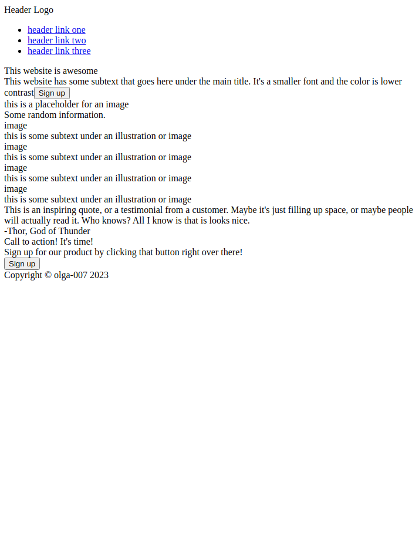
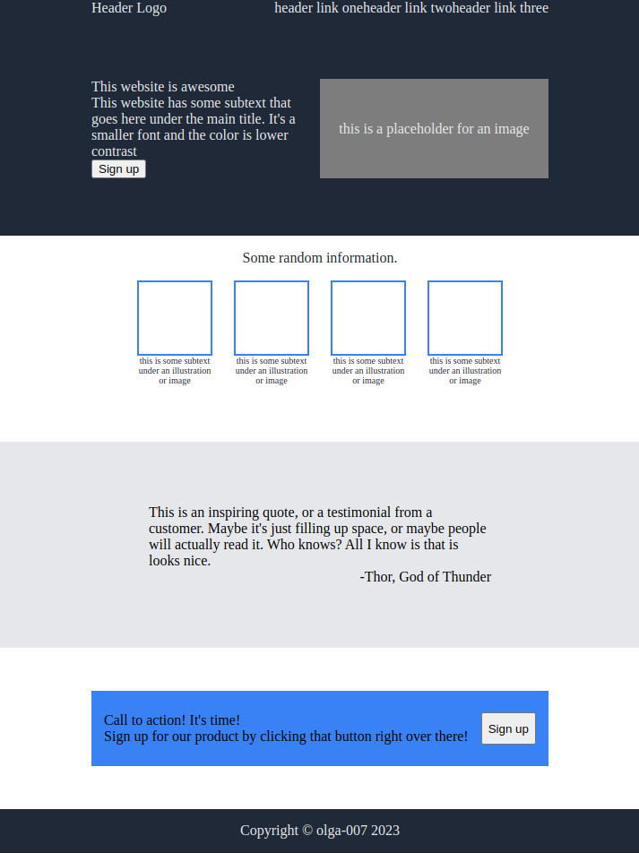

# Project "Landing Page"
## Task Description
<table>
  <tr>
    <th>Create a webpage that looks like this:</th>
    <th>Use these colors and fonts:</th>
  </tr>
  <tr>
    <td>
    </td>
    <td></td>
  </tr>
</table>

## Version 1 
Intitial version, an unstyled HTML file

## Version 2 
Draft styling using Flexbox

